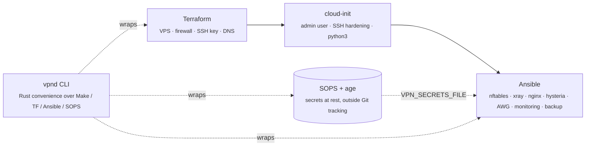
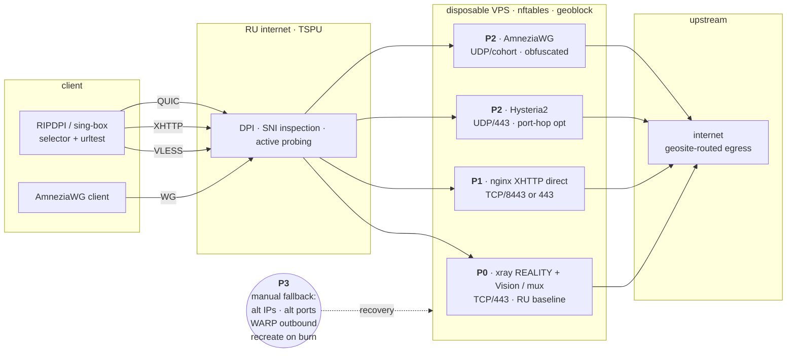
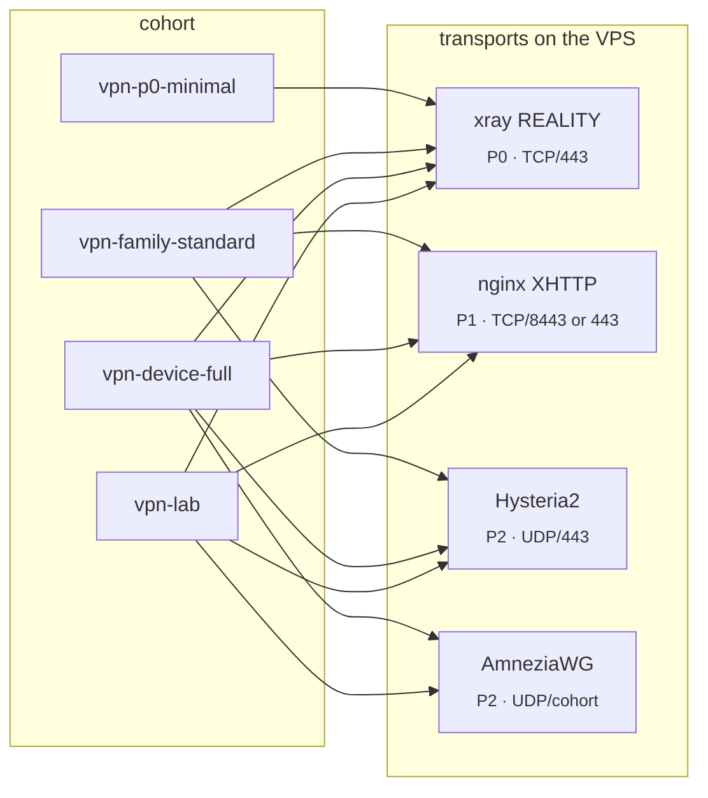

# vpn-deploy

[](https://github.com/po4yka/ripdpi-vpn-deploy/actions/workflows/ci.yml)
[](https://github.com/po4yka/ripdpi-vpn-deploy/actions/workflows/codeql.yml)
[](https://securityscorecards.dev/viewer/?uri=github.com/po4yka/ripdpi-vpn-deploy)
[](https://github.com/po4yka/ripdpi-vpn-deploy/releases)

Reproducible VPN deployment automation for the multi-profile access stack
(`P0` VLESS+REALITY+Vision → `P1` nginx+XHTTP direct → `P2` Hysteria2 +
AmneziaWG). Layered architecture: Terraform owns cloud resources,
cloud-init does first-boot bootstrap, Ansible owns runtime state, and
secrets stay outside Git tracking (SOPS + age), either in the external
operator directory or under the repository's git-ignored `secrets/local/`.

## Layers



Every layer is dry-runnable. Every layer has a rollback path. Nodes are
disposable: when an IP burns, recreate from git + secrets, do not repair.

## Stack

P0 is the RU baseline. P1 and P2 run alongside it as alternate transports;
clients carry selector + urltest logic so they automatically fail over to
whichever profile is still reachable. P3 is the operator-level recovery —
a burned IP is replaced, not repaired.



## Provider support

| Provider | Terraform root | Locked provider version |
|---|---|---|
| UpCloud | supported; P0 in `.fleet.mk.example` | 5.43.0 |
| Hetzner | supported | 1.68.0 |
| Vultr | supported; P2 in `.fleet.mk.example` | 2.32.0 |
| Scaleway | supported; P1 in `.fleet.mk.example` | 2.78.0 |

Switch via `make PROVIDER=upcloud …`.

## Deploy profiles

Default remains the historical device-full surface from `all.yml`. New deploys should choose an explicit cohort `group_vars` file in `ansible/group_vars/`:

- `vpn-p0-minimal.yml` — Xray REALITY only, plus monitoring/watchdog/backup.
- `vpn-family-standard.yml` — Xray REALITY + nginx-xhttp + Hysteria2, plus monitoring/watchdog/backup; no AmneziaWG.
- `vpn-device-full.yml` — family-standard + AmneziaWG; this matches the historical `all.yml` / `vpn-fullstack.yml` surface.
- `vpn-lab.yml` — lab/pilot profile. Research roles still require an explicit `allow_research_roles` opt-in in the same inventory scope.
- Legacy aliases remain: `vpn-p0.yml` for `vpn-p0-minimal`, `vpn-fullstack.yml` for `vpn-device-full`, and `vpn-p1p2.yml` for the older no-REALITY split host.



Assign a host to a cohort with `COHORTS=` on `render-inventory.sh`:

```bash
HOSTS="upcloud:prod" COHORTS="family-standard" ./scripts/render-inventory.sh
```

For a persistent local multi-provider mapping, copy `.fleet.mk.example` to the git-ignored `.fleet.mk`; `make inventory` forwards its `HOSTS` and `COHORTS` values to the renderer.

Or skip the inventory rebuild and tag-scope the play:
`ansible-playbook site.yml --tags p0` runs baseline + firewall + the P0
role only. Multi-VPS layouts: `docs/RUNBOOK-add-fallback.md`.

## Where to start

Agents and contributors: `AGENTS.md` and `CLAUDE.md` at the repo root carry
the working rules (per-folder variants apply when working inside a subtree).
Then:

1. `docs/DEPLOYMENT-STATUS.md` — sanitized current release, fleet mapping,
   observed live gates, and remaining verification boundaries.
2. `docs/QUICKSTART.md` — zero-to-working in ~30 minutes.
3. `docs/ARCHITECTURE.md` — how this repo maps to the P0–P3 stack.
4. `docs/CDN-DECISION.md` — explicit ADR: Cloudflare CDN is **not** the RU
   baseline; nginx-xhttp role is direct-only by default.
5. `docs/SECRETS.md` — SOPS+age model, age-key recovery, rotation.
6. `docs/AGE-RECOVERY.md` — Shamir-split the age key for k-of-n recovery.
7. `docs/TESTING.md` — coverage matrix and what's intentionally not tested.
8. `docs/BRANCH-PROTECTION.md` — apply required-status-check rules via GH API.
9. `docs/RUNBOOK-deploy.md` — full deploy procedure.
10. `docs/CLIENT-NOTES.md` — client-side bugs and version pins (AWG #2457,
   sing-box NaiveProxy padding leak, NaiveProxy v147 preamble).
11. `docs/SUBSCRIPTION-PLANE.md` — subscription-delivery contract matrix.
12. `docs/XRAY-RELEASE-LINE.md` — Xray-core 2026 release-line tracker
    (v26.2.6 → v26.7.11) with breaking-change notes for upgrades.
13. `docs/PQ-REALITY-ADOPTION.md` — enforced HOLD/STAGING/PRODUCTION policy
    for VLESS Encryption (PQE) over REALITY.
14. `docs/AWG-COHORTS.md` — AmneziaWG cohort obfuscation profiles by
    packet-shape signature (e.g. `narrow-junk-sequential`).
15. `docs/MULTI-COHORT.md` — multiple VLESS+REALITY inbounds per host,
    each with its own port/flow_mode/finalmask/clients.
16. `docs/MULTI-OPERATOR.md` — per-scope SOPS rules, role-scoped secrets
    files, audit-log boundaries.
17. `docs/SUBSCRIPTION-HOST-SEPARATION.md` — run the subscription
    delivery role on a dedicated VPS via `vpn_subscription_only`.
18. `docs/CI-REAL-DEPLOY.md` — workflow_dispatch ephemeral-UpCloud
    deploy gate for PRs labelled `ci-real-deploy`.
19. `docs/REGRESSION-BASELINE.md` — `rkn-block-checker` four-layer
    verdict harness for before/after deploy measurement.
20. `docs/PROBE-MATRIX.md` — topology-aware authenticated probe matrix with
    paired single-IP and split-hop targets, permission-checked profiles, and
    conservative protocol/class/topology observations.
21. `docs/TRANSPORT-REACHABILITY-MATRIX.md` — two-vantage per-profile
    reachability sweep, CI-driven non-filtered half + operator-driven
    filtered half.
22. `docs/SPLIT-HOP-TOPOLOGY.md` + `docs/RUNBOOK-split-hop-pilot.md`
    — ADR + operator runbook for the two-VPS split-hop topology that
    breaks the FOCI 2026 per-IP dual-role flow classifier.
23. `docs/RUNBOOK-idle-cycle-measurement.md` + `docs/measurements/`
    — measurement spike for the bare-HTTPS idle-cycle access-attempt
    pattern: driver + correlation tool + dated-report template.
24. `docs/REAL-VPS-AWG-NAT.md` — standalone three-host AWG/NAT evidence lane;
    provision through `make awg-evidence-provision` after decrypting SOPS.
25. `docs/XRAY-OBSERVABILITY.md` — loopback-only StatsService, redacted
    node_exporter counters, freshness checks, and failure interpretation.

Operational runbooks: `docs/RUNBOOK-{rotate,rollback,incident,restore,add-fallback}.md`.

## Contributing

PRs welcome — see `CONTRIBUTING.md`. Subjects follow Conventional Commits;
release-please picks them up automatically.

## Security

Critical issues (active probing, IP burn, key leak) → private channel per
`.github/SECURITY.md`. Don't open public issues for those.

## Make targets

```
# Core lifecycle
make init        # terraform init for the chosen PROVIDER
make validate    # fmt, validate, gitleaks, ansible-lint
make decrypt     # sops --decrypt → $(SECRETS_FILE), mode 0600
make plan        # terraform plan -out=<env>.tfplan
make apply       # terraform apply <env>.tfplan
make inventory   # render Ansible inventory from terraform outputs
make wait        # wait for cloud-init to finish on the new VPS
make dry-run     # ansible-playbook --check --diff
make deploy      # ansible-playbook site.yml
make deploy-canary # same deploy flow with ENV=canary
make os-maintenance # serial OS upgrade/reboot, then verify + security-verify
make verify      # post-deploy verification playbook
make source-drift # deployable-content parity against live node manifests
make security-verify # host hardening verification playbook
make clean       # shred decrypted secrets

# Rollback / rotation
make rollback-xray ROLLBACK_XRAY_VERSION=vX.Y.Z
make rollback-config
make rotate-credentials

# Operations
make destroy                              # safe, double-confirmation destroy
make backup-state                         # age-encrypt local TF state
make burn-check                           # external IP reachability probe
make diff-secrets                         # drift detection
make decrypt                             # materialize the private runtime secrets file
make emit-singbox CLIENT=<name>           # official sing-box P0/P2 JSON from that file
make clean                               # remove the runtime plaintext after use
make emit-awg CLIENT=<name>              # AmneziaWG wg-quick .conf for a named peer
make emit-bundle CLIENT=<name>           # RIPDPI P0/P1/P2 JSON with ripdpi extension
make install-hooks                        # one-time pre-commit setup
# vpnd subcommands (run from repo root or set VPN_DEPLOY_ROOT)
vpnd ai-docs [--out DIR]                  # emit repo docs as structured markdown for AI context
make molecule-test ROLE=<name>            # role-level idempotence test
make validate-target                      # pre-deploy REALITY target probe (9-step audit)
make scan-targets CIDR=<range>            # discover REALITY targets via RealiTLScanner
make security-audit                       # non-blocking host audit report
PYINFRA_HOSTS=host make pyinfra-audit      # experimental read-only pyinfra audit
make smoke-test                           # end-to-end traffic test (real proxy dial)
make xray-diagnostics                     # fresh redacted Xray counters over SSH
make snell-refinement BUNDLE=<json> CONFIG=<yaml> VANTAGE=<technical-id> # staging-only Snell payload/refinement matrix
make blue-green GREEN_ENV=<name>          # orchestrate blue-green replacement
```

`make help` is the canonical target inventory. `SOPS_FILE`, `SECRETS_FILE`,
`HOSTS`, and `COHORTS` may be set in the git-ignored `.fleet.mk`; the default
plaintext runtime path is
`${XDG_RUNTIME_DIR:-${TMPDIR:-/tmp}/vpn-provision-$(id -u)}/`.

`make deploy-canary` refuses production secrets, including production filenames
under a canary-named directory. Supply both `SECRETS_FILE` with basename
`vpn-canary.secrets.yaml` and `SOPS_FILE` with basename `canary.secrets.sops.yaml`.

## Hard rules

- No secrets in git, in Terraform state, in Terraform variables/outputs, in
  cloud-init `user_data`, in Ansible debug output, or in screenshots.
- No public admin panel. No remote installer piped into a root shell.
- One UUID / one shortId / one peer key **per device**, never shared.
- Pinned versions. Pre-release versions go through staging only.
- CI gate: gitleaks must pass with the `.gitleaks.toml` rules in this repo.

## License

BSD 3-Clause (see `LICENSE`).
